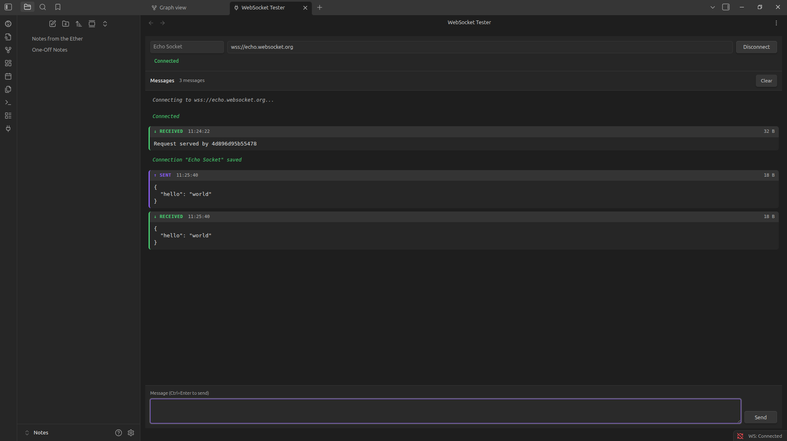
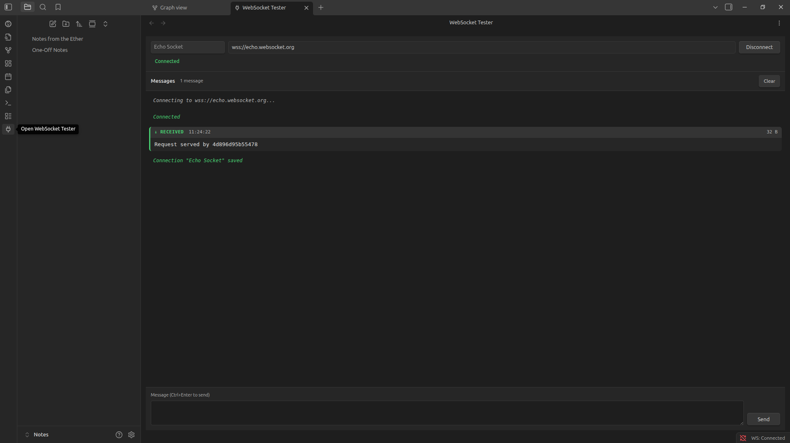
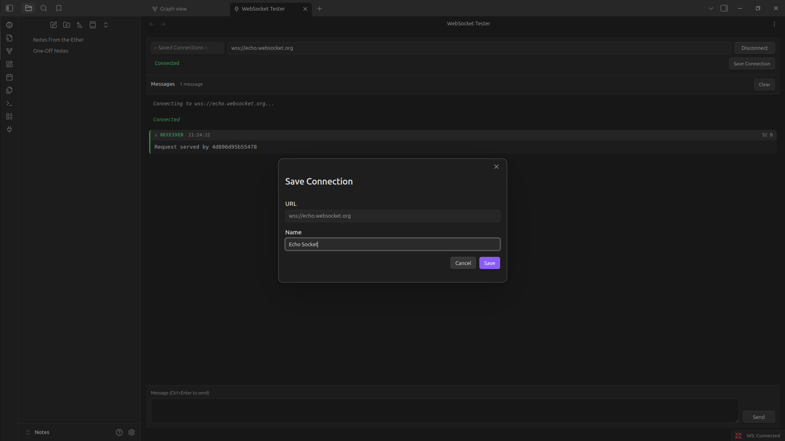
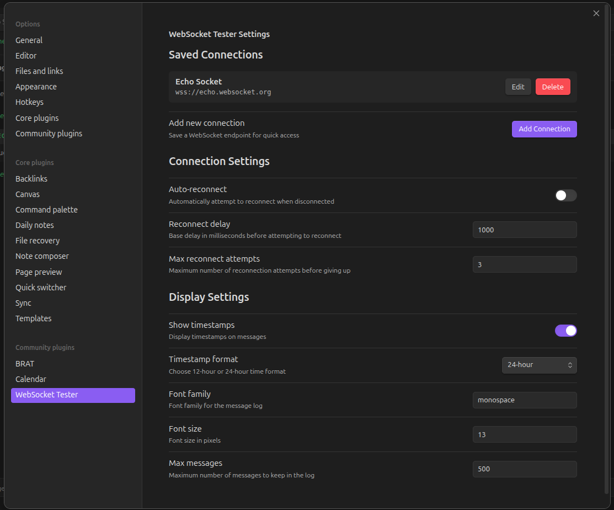

# WebSocket Tester Plugin for Obsidian

A WebSocket testing and debugging tool for Obsidian. Connect to WebSocket servers, send messages, and view real-time responses—all within your vault.



## Features

- **WebSocket Connections** - Connect to any WebSocket server via `ws://` or `wss://` protocols
- **Message Log** - View sent and received messages with timestamps and size indicators
- **JSON Formatting** - Automatically detects and pretty-prints JSON messages
- **Connection Management** - Save and manage multiple WebSocket endpoints
- **Message History** - Navigate previous messages with up/down arrow keys
- **Auto-Reconnect** - Optionally reconnect on unexpected disconnections
- **Status Bar** - Shows current connection status

## Installation

### Manual Installation

1. Download the latest release
2. Extract to your vault's `.obsidian/plugins/` directory
3. Enable the plugin in Obsidian's Community Plugins settings

### Building from Source

```bash
npm install
npm run build
```

## Usage

### Opening the Tester

Click the plug icon in the left ribbon, or use the command palette:
- `Open WebSocket Tester`



### Connecting to a Server

1. Enter a WebSocket URL in the connection bar (e.g., `wss://echo.websocket.org`)
2. Click **Connect**

Or select a saved connection from the dropdown.

### Saving Connections

When connected to an unsaved URL, click **Save Connection** to save it for quick access later.



### Sending Messages

Type your message in the composer at the bottom and click **Send** or press `Ctrl+Enter`.

### Managing Saved Connections

Go to **Settings > WebSocket Tester** to add, edit, or remove saved connections.



## Commands

| Command | Description |
|---------|-------------|
| `Open WebSocket Tester` | Open the WebSocket tester view |
| `Disconnect WebSocket` | Disconnect from current server |
| `Clear WebSocket message log` | Clear the message log |

## Keyboard Shortcuts

| Shortcut | Action |
|----------|--------|
| `Ctrl+Enter` | Send message |
| `Up Arrow` | Previous message in history |
| `Down Arrow` | Next message in history |

## Settings

- **Saved Connections** - Manage your list of WebSocket endpoints
- **Auto-reconnect** - Reconnect automatically on disconnection
- **Reconnect delay** - Base delay before reconnection attempts
- **Max reconnect attempts** - Maximum reconnection tries
- **Show timestamps** - Display timestamps on messages
- **Timestamp format** - Choose 12-hour or 24-hour format
- **Font family** - Message log font (default: monospace)
- **Font size** - Message log font size in pixels
- **Max messages** - Limit message history for memory management

## Requirements

- Obsidian v1.10.0 or higher

## License

MIT
